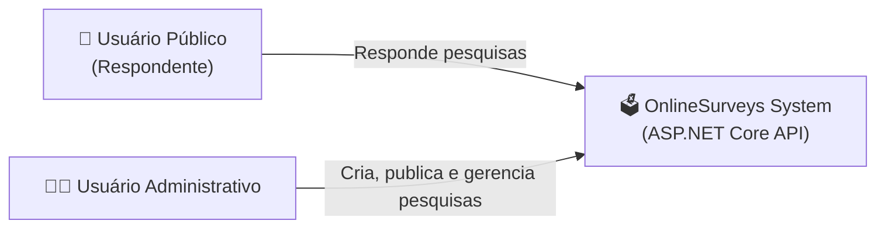
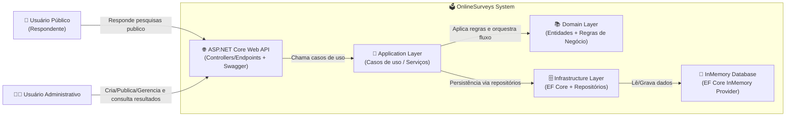

# Arquitetura da Solução – Online Surveys

Este documento descreve a arquitetura do sistema **Infnet.OnlineSurveys**, desenvolvido como parte de um projeto acadêmico com foco em **Arquitetura de Software**, escalabilidade conceitual e boas práticas utilizando a plataforma **.NET**.

A arquitetura foi definida considerando:
- Simplicidade de implementação
- Clareza de comunicação com desenvolvedores e usuários
- Prazo reduzido de entrega
- Possibilidade de evolução futura

---

## 🎯 Visão Geral

O sistema **OnlineSurveys** tem como objetivo permitir a **criação, publicação e coleta de respostas de pesquisas online**, com foco em questionários de múltipla escolha, como pesquisas públicas e eleitorais.

O sistema foi projetado para:
- Suportar grande volume de respostas (conceitualmente)
- Separar claramente responsabilidades
- Facilitar manutenção e testes

---

## 🧩 Modelo Arquitetural Adotado

Foi adotada uma abordagem baseada em **Clean Architecture**, aliada ao **C4 Model** para documentação arquitetural.

### Motivações da escolha

- 📌 **Clean Architecture**
  - Promove baixo acoplamento
  - Facilita testes automatizados
  - Isola regras de negócio da infraestrutura
  - Muito bem aceita no meio acadêmico

- 📌 **C4 Model**
  - Comunicação clara em diferentes níveis de abstração
  - Facilita explicação para públicos técnicos e não técnicos
  - Adequado para documentação arquitetural (não de código)

---

## 🌍 C4 – Context Diagram

### Descrição

O sistema **OnlineSurveys** é acessado por dois tipos principais de usuários:

- **Usuário Público**
  - Responde pesquisas publicadas
  - Não necessita autenticação

- **Usuário Administrativo**
  - Cria e gerencia pesquisas
  - Publica e fecha questionários
  - Consulta resultados consolidados

Ambos acessam o sistema através de uma **API REST**.

#### C4 Nível 1

Mostra quem usa o sistema e como ele se conecta ao mundo externo. Essa visao e adequada para o
usuario do sistema e para alinhar expectativas com o time.


#### C4 Nível 2


## 🖥️ Frontend

Para este projeto, não foi desenvolvido um frontend (Web ou Mobile).  
Como o objetivo principal é validar a **arquitetura**, os **fluxos de negócio** e as **regras do sistema** dentro de um prazo reduzido, foi decidido utilizar o **Postman** como cliente da aplicação, exercendo o papel de frontend.

A interação com a API é feita por meio de uma **Postman Collection**, na qual os endpoints estão organizados seguindo a ordem do **Fluxo Completo** do sistema (criação da pesquisa, adição de perguntas e opções, publicação, submissão de respostas e consulta de resultados).  
Essa abordagem facilita a execução, a validação funcional e a avaliação acadêmica do projeto.

---

## 🧪 Testes

Os testes automatizados do projeto foram desenvolvidos utilizando o **xUnit**.

O objetivo dos testes é garantir:
- Consistência das regras de publicação da pesquisa
- Restrições de alteração conforme o status da pesquisa

### ▶️ Como executar os testes

Na raiz da solução, execute o comando:

```bash
dotnet test
```

> Observação: os testes foram escritos de forma isolada, sem dependência de infraestrutura externa, reforçando o baixo acoplamento entre as camadas do sistema.

---

## 💾 Dados | Entity Framework

A persistência de dados foi implementada utilizando **Entity Framework Core** com o provider **InMemory**.

### 📌 Justificativa da escolha

A utilização do **Entity Framework InMemory** foi uma decisão consciente, considerando que o projeto se trata de uma **POC (Proof of Concept)** com foco acadêmico. Essa escolha oferece os seguintes benefícios:

- Elimina a necessidade de configuração de banco de dados externo
- Reduz complexidade de setup e riscos de ambiente
- Facilita a execução e avaliação do projeto
- Permite validar rapidamente os fluxos e a arquitetura proposta

### ⚠️ Considerações importantes

- Os dados são armazenados apenas em memória e **são perdidos ao reiniciar a aplicação**
- Esse comportamento é esperado e aceitável para o contexto do projeto
- Em um cenário de produção, o provider InMemory poderia ser substituído por um banco relacional como **SQL Server** ou **PostgreSQL**, sem impacto significativo nas camadas de domínio e aplicação

### Contexto Geral

